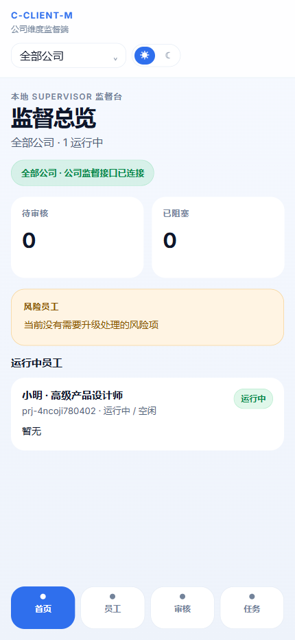

# C-CLIENT-M

`C-CLIENT-M` 是 `C-CLIENT` 的移动端监督前端，面向主管 / 调度者使用。

[](https://github.com/cwwlla01/C-CLIENT-M/actions/workflows/ci.yml)



它聚焦公司维度的移动监督能力：

- 首页监督总览
- 员工列表与员工详情抽屉
- 审核消息处理
- 任务中心与固定主动作
- 发布任务弹层
- Light / Dark 双主题

执行端、bridge、本地运行时宿主、项目空间管理等核心能力开源在：

- [C-CLIENT](https://github.com/cwwlla01/C-CLIENT)

相关文档可直接参考：

- [C-CLIENT / docs / docker-podman.md](https://github.com/cwwlla01/C-CLIENT/blob/main/docs/docker-podman.md)
- [C-CLIENT / docs / local-api-reference.md](https://github.com/cwwlla01/C-CLIENT/blob/main/docs/local-api-reference.md)
- [C-CLIENT / docs / mvp-current-state.md](https://github.com/cwwlla01/C-CLIENT/blob/main/docs/mvp-current-state.md)
- [C-CLIENT-M / docs / deployment.md](./docs/deployment.md)

## 技术栈

- React 19
- TypeScript
- Vite
- Tailwind CSS / DaisyUI / 自定义样式 token

## 环境变量

默认部署策略已经改成“同源 API”。

也就是：

- 前端默认直接请求同源 `/api/*` 和 `/health`
- 生产环境推荐由 Nginx / 网关做同源反代
- `npm run preview` / Docker 也可以由内置 `server.mjs` 代做同源转发
- Vercel 部署会通过仓库内的 `api/*` Functions 保持同源代理和密码门禁

构建阶段变量：

- `VITE_APP_TITLE`
  顶部产品名，默认 `C-CLIENT-M`
- `VITE_PROJECT_ROOT`
  `POST /api/workspace/discover` 使用的项目根目录，默认 `/workspace/company`
- `VITE_CCLIENT_KEY`
  当 bridge 开启 API Key 时传入
- `VITE_BRIDGE_HTTP_ORIGIN`
  可选，仅用于本地 Vite 开发代理或特殊调试场景；生产同源部署时通常留空
- `VITE_BRIDGE_WS_ORIGIN`
  可选，CLI 实时会话 WebSocket 入口。自部署同源 `/terminal` 时通常留空；若前端部署在 Vercel 等不便代理 WebSocket 的环境，可显式指定 `wss://...`

运行时变量：

- `APP_LOGIN_PASSWORD`
  为 `npm run preview` / Docker 部署提供访问密码。设置后，首次进入页面会先看到密码校验页。
- `BRIDGE_PROXY_TARGET`
  为 `server.mjs` / Vercel Functions 提供后端 bridge 目标地址。设置后，同源 `/api/*` 和 `/health` 会转发到该地址。

可直接从示例文件开始：

```bash
cp .env.example .env.local
```

## 本地开发

```bash
npm install
npm run dev
```

默认前端地址由 Vite 输出。

本地开发时，Vite 会把下面这些同源请求代理到 `VITE_BRIDGE_HTTP_ORIGIN`，若未设置则默认转发到 `http://127.0.0.1:4285`：

- `/health`
- `/api/settings`
- `/api/workspace`
- `/api/runtime`
- `/api/employee`
- `/api/task`
- `/terminal` WebSocket

## 构建

```bash
npm run build
```

## 访问密码

如果你希望部署后先输入密码再进入系统，可以在运行时设置：

```bash
APP_LOGIN_PASSWORD=your-password npm run preview
```

或在 Docker / compose 中设置：

```bash
APP_LOGIN_PASSWORD=your-password
```

说明：

- 密码校验发生在同源预览服务 `/api/auth/*`
- 前端不会把密码编进构建产物
- 本地 `npm run dev` 默认不启用这层校验，方便样式和交互开发

Windows PowerShell 示例：

```powershell
$env:APP_LOGIN_PASSWORD = "your-password"
npm run preview
```

## CI

仓库已内置 GitHub Actions 工作流：

- `.github/workflows/ci.yml`
- `.github/workflows/docker-deploy.yml`

默认在 `push main` 和 `pull_request` 时执行：

```bash
npm ci
npm run build
```

`docker-deploy.yml` 会在 `main` 分支 push 或手动触发时执行：

- 构建 Docker 镜像
- 推送到 Docker Hub
- 通过密码 SSH 登录服务器
- 在远端 `DEPLOY_PATH` 写入 `compose.yaml`
- 执行 `docker compose pull && docker compose up -d`

需要在 GitHub 仓库 Secrets 中提供：

- `DOCKERHUB_USERNAME`
- `DOCKERHUB_TOKEN`
- `SSH_HOST`
- `SSH_PORT`
- `SSH_USER`
- `SSH_PASSWORD`
- `DEPLOY_PATH`
- `APP_LOGIN_PASSWORD`
- `BRIDGE_PROXY_TARGET`
- `VITE_CCLIENT_KEY`

## Docker 部署

当前仓库支持独立打包为静态前端容器。

### 构建镜像

```bash
docker build -t c-client-m:local .
```

如果你要覆盖标题或项目根目录：

```bash
docker build \
  --build-arg VITE_APP_TITLE=C-CLIENT-M \
  --build-arg VITE_PROJECT_ROOT=/workspace/company \
  -t c-client-m:local .
```

只有在你明确想让前端直接跨域访问 bridge 时，才需要额外传入：

```bash
docker build \
  --build-arg VITE_BRIDGE_HTTP_ORIGIN=http://127.0.0.1:4285 \
  -t c-client-m:local .
```

### 直接运行

```bash
docker run --rm -it \
  -e APP_LOGIN_PASSWORD=your-password \
  -e BRIDGE_PROXY_TARGET=http://127.0.0.1:4285 \
  -p 4275:80 \
  c-client-m:local
```

启动后访问：

- Frontend: `http://127.0.0.1:4275`

### 使用 compose

```bash
docker compose up --build
```

当前 `docker-compose.yml` 默认：

- 前端容器端口：`80`
- 宿主机映射端口：`4275`
- 运行时同源代理目标：`http://host.docker.internal:4285`
- 若要启用密码门禁，请在 compose 环境里提供 `APP_LOGIN_PASSWORD`

## Nginx 反代

仓库根目录已经附带一份可直接改机器地址的示例配置：

- [nginx.conf](./nginx.conf)

默认约定：

- `127.0.0.1:4275` 是 `C-CLIENT-M` 前端 / 预览服务
- `127.0.0.1:4285` 是 bridge
- `/api/auth/*` 转给前端服务
- `/api/*` 和 `/health` 转给 bridge
- `/terminal` WebSocket 转给 bridge

这样浏览器始终只访问同一个域名，不会出现 `https` 前端直接请求 `http` 后端的 mixed content。

## Vercel

仓库已经补了：

- [vercel.json](./vercel.json)
- [`api/auth/session.js`](./api/auth/session.js)
- [`api/auth/login.js`](./api/auth/login.js)
- [`api/auth/logout.js`](./api/auth/logout.js)
- [`api/health.js`](./api/health.js)
- [`api/[...path].js`](./api/%5B...path%5D.js)

这意味着在 Vercel 上：

- `/api/auth/*` 由 Vercel Functions 处理密码门禁
- `/api/*` 由 Vercel Functions 反代到 `BRIDGE_PROXY_TARGET`
- `/health` 通过 [vercel.json](./vercel.json) rewrite 到 `/api/health`
- `/terminal` 不经过 Vercel Functions；若要使用实时 CLI，请把 `VITE_BRIDGE_WS_ORIGIN` 指向可访问的 `wss://...` bridge 入口

推荐在 Vercel 项目里配置这些环境变量：

- `BRIDGE_PROXY_TARGET`
- `APP_LOGIN_PASSWORD`
- `VITE_APP_TITLE`
- `VITE_PROJECT_ROOT`
- `VITE_CCLIENT_KEY`
- `VITE_BRIDGE_WS_ORIGIN`

如果你的后端仍然是 `http://...`，Vercel 这套方案也能兼容，因为浏览器访问的是 Vercel 自己的 `https` 域名，请求由服务端函数再转发到后端。

## 数据来源说明

本项目当前已经切到真实接口优先，并且默认按同源方式访问：

- 前端默认请求同源 `/api/*` 和 `/health`
- 如果使用 `server.mjs` / Docker / Vercel Functions，可通过 `BRIDGE_PROXY_TARGET` 转发到 bridge
- 如果使用 Nginx / 网关，推荐直接在入口层转发 `/api/*` 和 `/health`
- bridge / discover 异常时前端直接显示错误，不再静默回退 mock

其中公司下拉直接使用 `POST /api/workspace/discover` 返回的 `companies` 字段。

## 开源边界

`C-CLIENT-M` 只负责移动端监督前端。

下面这些不在本仓库内：

- CLI / Codex 会话宿主
- bridge 服务
- 项目空间初始化与恢复
- Docker / Podman 下的执行端运行链路

这些都在 [C-CLIENT](https://github.com/cwwlla01/C-CLIENT) 中维护。

## License

[MIT](./LICENSE)
